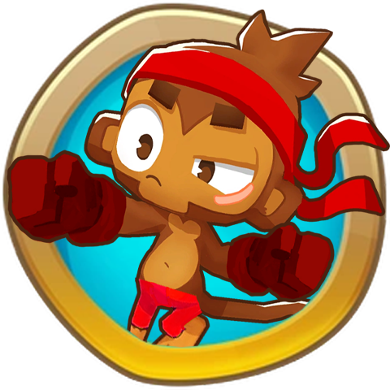

<h1 align="center">

Boxer Monkey
</h1>

### Adds a new Boxer Monkey Tower, a new Primary Tower that uses quick melee attacks to pop Bloons!

This tower Contains:
* 15 Complete Upgrades
* Custom Icons, portraits and 3D Models

Planned
* a Paragon Upgrade
* Ultimate Crosspath Mod compatibility

